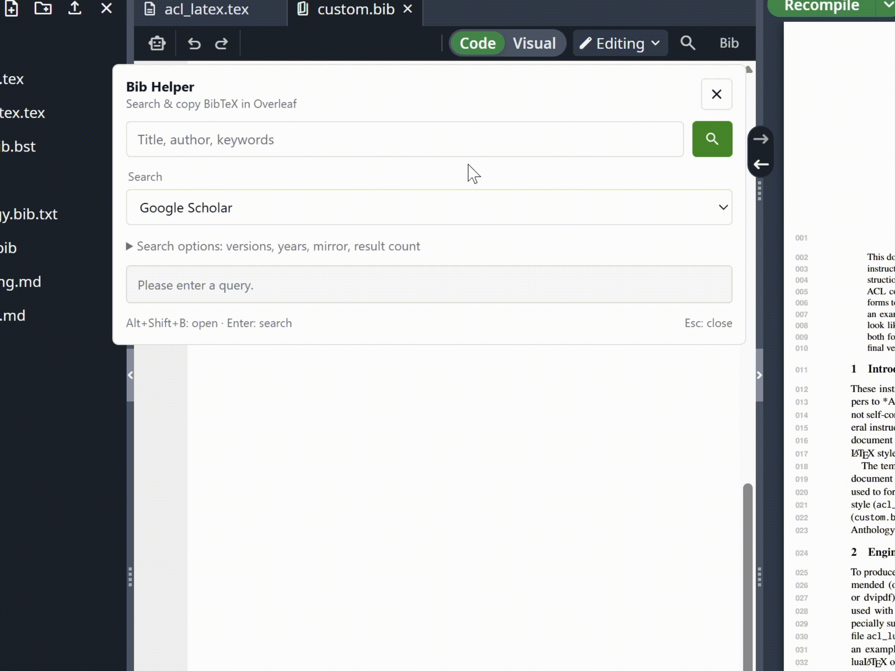

<div align="center">
  
  <h1>Overleaf-Bib-Helper</h1>
</div>

一个增强 Overleaf 功能的用户脚本，支持直接在 Overleaf 编辑器内搜索论文，并从 DBLP 和 Google Scholar 来源获取 BibTeX 条目。

<p align="center">
  <a href="https://greasyfork.org/zh-CN/scripts/532304-overleaf-bib-helper">
    
  </a>
  <a href="https://github.com/MLNLP-World/Overleaf-Bib-Helper/releases">
    
  </a>
  <a href="LICENSE">
    
  </a>
  <a href="https://github.com/MLNLP-World/Overleaf-Bib-Helper/stargazers">
    
  </a>
  <a href="https://github.com/MLNLP-World/Overleaf-Bib-Helper/network/members">
    
  </a>
  <a href="https://github.com/MLNLP-World/Overleaf-Bib-Helper/issues">
    
  </a>
  <a href="https://github.com/MLNLP-World/Overleaf-Bib-Helper/pulls">
    
  </a>
</p>

<div>
<p align="center">
      <a href="#项目动机">项目动机</a> •
      <a href="#更新日志">更新日志</a> •
      <a href="#快速开始">快速开始</a> •
      <a href="#使用方法">使用方法</a> •
      <a href="#支持的来源">支持的来源</a> •
      <a href="#故障排除">故障排除</a> •
      <a href="#免责声明">免责声明</a> •
      <a href="#反馈和贡献">反馈和贡献</a> •
      <a href="#致谢">致谢</a>
    </p>
</div>

<div align="center">

中文 | [English](./README_en.md)

</div>



- **官方 BibTeX 聚合**：支持 NeurIPS、PMLR、ACL、OpenReview、CVF、ECVA/Springer、BMVC、AAAI、IJCAI、KR、ACM、IEEE；显示出处，并提供 DBLP fallback。
- **Overleaf 无缝集成**：兼容新旧 toolbar，切换文件/布局后自动恢复 `Bib` 按钮，跟随明暗主题，小窗口可用。
- **随手唤起，一键引用**：`Alt+Shift+B` 或菜单打开，选中标题自动带入搜索；支持 DBLP / Google Scholar 与多个镜像；可预览/编辑 BibTeX、改 key、复制 key 或 `\cite{key}`、下载 `.bib`。
- **智能结果与版本管理**：同标题合并为 “Versions (n)”，一键 “Copy best”；DBLP 优先正式版、降权 arXiv/CoRR；支持年份过滤、排序和搜索配置（5/10/20/50 条结果）。

## 项目动机

编写LaTeX文档通常需要包含大量的学术参考文献。手动搜索和格式化BibTeX条目可能非常耗时。Overleaf-Bib-Helper通过将DBLP和Google Scholar的搜索功能集成到Overleaf界面中，简化了这一过程，使用户能够快速找到并复制BibTeX条目，省时省力。

#### 本项目包含以下功能
**1. 多源学术检索与筛选**
  - 支持在 Overleaf 中直接检索 DBLP 和 Google Scholar。
  - 覆盖 AI、ML、NLP、CV 等领域的主流出版平台，包括NeurIPS、PMLR、ACL Anthology、OpenReview、CVF、ECVA/Springer、BMVC、AAAI、IJCAI、KR、ACM 和 IEEE。
  - 提供显式 DBLP fallback，并支持多个 Google Scholar 镜像，提高可访问性。
  - 自动合并同标题论文，并以“Versions (n)”集中展示不同版本。
  - 支持正式发表版本优先，自动过滤或降权 arXiv/CoRR 预印本。
  - 支持按年份筛选，并按相关性、时间等方式排序。
  - 可配置返回5、10、20或50条检索结果。

**2. BibTeX预览、编辑与导出**
  - 展示论文引用出处及原始 BibTeX 信息。
  - 支持 BibTeX 在线预览与编辑，并可修改 citation key。
  - 支持一键复制 citation key、`\cite{key}` 或完整BibTeX条目。
  - 支持下载`.bib`文件。
  - 保存最近10次查询并缓存已验证的 BibTeX，同时保留用户的数据源偏好。
  - 对同标题的多个版本支持一键“Copy best”，快速获取最佳引用版本。

**3. Overleaf集成与便捷交互**
  - 适配新版和旧版 Overleaf 工具栏，切换文件或布局后可自动恢复Bib按钮。
  - 支持通过 `Alt+Shift+B` 或 Tampermonkey 菜单快速打开，并自动将选中的论文标题填入搜索框。
  - 提供可折叠的高级检索选项和可滚动的结果列表，适配小窗口及明暗主题。
  - 支持快捷键操作：按 Enter 搜索，按 Esc 关闭弹窗。

## 更新日志
<details> 
<summary> <b>2026-09-07 (v2.2.1)</b> </summary>
扩展 CVF、ECVA/Springer、已核实的 BMVC proceedings、AAAI 系列会议、IJCAI、KR、ACM、IEEE 官网原始 BibTeX。新增 DOI 路由、出版社记录匹配、旧 AAAI 页面迁移和可取消的 ACM 引用窗口 bridge；增加官网格式、历史页面与跨标签生命周期 regression tests。v2.2.0 系列仅用于本地验证。
</details>

<details>
<summary> <b>2026-09-07 (v2.1.0)</b> </summary>
新增 NeurIPS、PMLR、ACL Anthology、OpenReview 官网原始 BibTeX；分离检索与引用来源偏好，显示引用出处，支持显式切回 DBLP；保留官网字段并验证 URL 与发表状态。新增官方来源及请求过期 regression tests。
</details>

<details> 
<summary> <b>2026-09-07 (v2.0.2)</b> </summary>

toolbar 入口改为无边框的 **Bib** 纯文字按钮，保留键盘操作时的焦点提示。
</details>

<details>
<summary> <b>2026-09-07 (v2.0.1)</b> </summary>
适配新版 toolbar，支持布局切换后恢复入口；移除外部运行依赖；新增快捷键、menu、选中文字搜索、最近查询、BibTeX preview/edit/key/citation/download；增加 timeout、HTTP 与 BibTeX 验证、过期搜索保护、Scholar origin 固定和显式验证入口；修复多语言分组与 Hide preprints 筛选。新增 Playwright regression tests 和 GitHub Actions。
</details>

<details>
<summary> <b>2026-02-03</b> </summary>
代码清理与重构，使用 MutationObserver 进行注入（减少轮询），并放宽 `@connect` 以支持自定义 Scholar 镜像（v1.8）。
</details>

<details>
<summary> <b>2026-02-03</b> </summary>
Overleaf 主题配色的全新 UI、默认使用 Google Scholar、同标题结果合并为 “Versions (n)” 版本选择、增加镜像选择并支持结果分页（超过 10 条可继续获取），并提供排序/年份范围过滤与 DBLP 版本偏好（优先正式发表版本，过滤/降权 arXiv/CoRR）（v1.7）。
</details>

<details>
<summary> <b>2025-04-10</b> </summary>
增加了对 cn.overleaf.com 和 cn.overleaf.com 域的支持（v1.2）。
</details>

<details>
<summary> <b>2025-04-09</b> </summary>
初始版本，支持DBLP和Google Scholar的基本功能（v1.1）。
</details>

## 快速开始

### 第一步：安装Tampermonkey
Tampermonkey是一个运行Overleaf-Bib-Helper等用户脚本所需的浏览器扩展。按照以下步骤操作：
1. **下载Tampermonkey**：
   - **Chrome**：[Chrome网上商店](https://chrome.google.com/webstore/detail/tampermonkey/dhdgffkkebhmkfjojejmpbldmpobfkfo)
   - **Firefox**：[Mozilla插件](https://addons.mozilla.org/en-US/firefox/addon/tampermonkey/)
   - **Edge**：[Microsoft Edge插件](https://microsoftedge.microsoft.com/addons/detail/%E7%AF%A1%E6%94%B9%E7%8C%B4/iikmkjmpaadaobahmlepeloendndfphd)
   - **Safari**：[应用商店](https://apps.apple.com/us/app/tampermonkey/id1482490089)（需要macOS）
2. **启用Tampermonkey**：
   - 安装完成后，点击浏览器工具栏中的Tampermonkey图标，确保其已启用。
3. **允许运行 userscripts**：
   - Chrome 138+ 可在 Tampermonkey 的扩展管理页开启 **Allow User Scripts（允许用户脚本）**；也可开启扩展开发者模式。见 [Tampermonkey 官方说明](https://www.tampermonkey.net/faq.php?q=Q209)。

### 第二步：安装Overleaf-Bib-Helper
您可以通过以下两种方式之一安装脚本：

#### 选项1：从Greasy Fork安装（推荐）
1. 访问[Greasy Fork页面](https://greasyfork.org/zh-CN/scripts/532304-overleaf-bib-helper)。
2. 点击**“安装此脚本”**按钮。
3. Tampermonkey将打开一个确认窗口。点击**“安装”**以添加脚本。
4. 脚本将在Overleaf项目页面（`https://www.overleaf.com/project/*`）上自动激活。
5. 为保持脚本更新，请在Tampermonkey设置中启用自动更新。

#### 选项2：从GitHub安装
1. 前往[GitHub仓库](https://github.com/MLNLP-World/Overleaf-Bib-Helper)。
2. 打开仓库中的`Overleaf-Bib-Helper.js`文件。
3. 复制整个脚本内容。
4. 在浏览器中，点击Tampermonkey图标 > **“创建新脚本”**。
5. 将复制的代码粘贴到编辑器中，替换默认模板。
6. 在Tampermonkey编辑器中点击**文件 > 保存**。
7. 脚本将在Overleaf项目页面上激活。
8. 脚本包含 Greasy Fork 的正式更新地址，从 GitHub 手动安装也可通过 Tampermonkey 接收后续更新。

## 使用方法
### 打开工具
1. 在浏览器中打开Overleaf项目（`https://www.overleaf.com/project/*`）。
2. 点击 editor toolbar 右侧的 **Bib** 按钮；editor toolbar 不可见时，按钮会使用项目顶栏。
3. 也可按 **Alt+Shift+B**，或从 Tampermonkey menu 选择 **Open Bib Helper**。选中论文标题后打开，会自动填入搜索框。


### 搜索文章
1. **输入查询**：在输入字段中键入搜索词（例如文章标题、作者或关键词）。
2. **选择 Search**：从“Search”下拉菜单中选择“DBLP”或“Google Scholar”。
   - **DBLP**：最适合计算机科学文献，提供结构化数据。
   - **Google Scholar**：覆盖更广泛的领域，但可能需要验证码验证。
   - 使用 DBLP 时，**BibTeX → Official venue when available** 会从已支持的官方论文链接获取原始引用；选择 **DBLP** 则使用 DBLP 的导出。
3. **设置结果数量**：从“结果”下拉菜单中选择5、10、20或50个结果。
4. **开始搜索**：
   - 按下**Enter**键或点击放大镜图标。
   - 展开 **Search options** 设置版本、年份、mirror、排序和结果数。DBLP 的筛选与排序作用于最多 200 条候选结果，并非整个数据库。
5. 结果将显示在输入字段下方的可滚动列表中。

### 复制BibTeX
1. 点击 **Copy** 复制条目，或 **Preview** 查看并编辑 BibTeX。
2. Preview 中可修改 citation key，复制 BibTeX、key、`\cite{key}`，或下载 `.bib` 文件。
3. 先把条目加入项目的 `.bib` 文件，再将 citation command 粘贴到 LaTeX 文档。脚本不会自动修改项目文件。
4. 预览中的复制和下载会验证 BibTeX；网络错误或验证码页面不会覆盖剪贴板。
5. 结果与 preview 会标明 BibTeX 来源，保留官网原始 citation key 和字段。官网读取失败时可点击 **Use DBLP BibTeX** 切换偏好并重新搜索；不会静默替换或自动复制另一来源的引用。

<!-- <div align="center">

</div> -->

### 关闭弹出窗口
- 按下**Esc**键或再次点击工具栏图标。

## 支持的来源
- **DBLP**：跨会议检索论文并提供正式出版链接。搜索范围仍受 DBLP 收录情况限制，不是直接对各会议官网做全文搜索。
- **Google Scholar**：一个更广泛的学术搜索引擎，可能包括更多最新或跨学科的作品，但可能需要用户验证（例如验证码）。

对 DBLP 结果，默认 BibTeX 偏好可读取以下官网导出：

| 官网来源 | 覆盖示例 | 获取方式 |
| --- | --- | --- |
| [NeurIPS proceedings](https://proceedings.neurips.cc/) | NeurIPS / NIPS | 读取论文页实际提供的 BibTex 链接，兼容旧年份与新版 tracks |
| [PMLR](https://proceedings.mlr.press/) | ICML、AISTATS、COLT、UAI、CoRL | 读取论文页内的原始 BibTeX |
| [ACL Anthology](https://aclanthology.org/info/ids/) | ACL、EMNLP、NAACL、EACL、COLING、IJCNLP、LREC、Findings | 官方 `.bib` 文件，兼容旧版 ID |
| [OpenReview](https://github.com/openreview/openreview-web/blob/master/components/forum/ForumNote.js) | ICLR、COLM 等已收录 proceedings | 读取官方 API 的 `_bibtex`，并核对发表状态 |
| [CVF Open Access](https://openaccess.thecvf.com/) | CVPR、ICCV、WACV、ACCV、相关 workshops、ECCV 2018 | 读取原始 BibTeX block，识别新版和历史论文/PDF 链接 |
| [ECVA](https://www.ecva.net/papers.php) / [Springer](https://link.springer.com/) | ECCV、ACCV、MICCAI、ECML PKDD 等 Springer proceedings | 读取出版社 BibTeX；ECVA 使用论文页实际提供的 Springer 链接 |
| [BMVA / BMVC](https://www.bmva.org/bmvc) | BMVC 2023–2025、归档的 2015–2017 | 读取已核实论文页面的原始 citation block |
| [AAAI OJS](https://ojs.aaai.org/) | AAAI、ICAPS、ICWSM、AIIDE、AIES、HCOMP、SoCS、AAAI-SS | 使用论文实际的 BibTeX 下载链接；旧版页面通过官方 DOI 解析迁移后的记录 |
| [IJCAI](https://www.ijcai.org/proceedings/) | 2017 年起的 IJCAI proceedings | 官网单篇 BibTeX export |
| [KR](https://proceedings.kr.org/) | KR proceedings | 读取官方论文页提供的 BibTeX 链接 |
| [ACM Digital Library](https://dl.acm.org/) | KDD、WWW、SIGIR、CIKM、WSDM、ACM MM，以及有 ACM 链接的 AAMAS 论文 | 打开临时出版社标签，读取官网引用窗口实际生成的 BibTeX |
| [IEEE Xplore](https://ieeexplore.ieee.org/) | ICDM、ICASSP、ICIP、IJCNN、ICDE 等 IEEE proceedings | 官网原始 BibTeX 下载，受出版社验证与访问限制影响 |

支持范围取决于论文的出版链接和官网是否提供 export，不能仅凭会议名称保证每个年份、track 和论文都可用。支持已接入出版社的 DOI 链接；同一结果同时提供 CVF 与 IEEE 时优先 CVF。不支持的链接、只有 PDF 的历史 proceedings 和 preprint 使用 DBLP，并明确标注。已列范围外的 BMVC 年份、2017 年前的 IJCAI 暂用 DBLP，除非存在其他已支持的出版社链接。

脚本保留出版社原有的 key、字段与出版年份，包括出版年份与会议年份不同的情况。OpenReview 缺少官方 export，或标记为 submitted/rejected/withdrawn 的引用不会被当成正式会议版本。部分出版社可能要求浏览器验证；出错时可打开官方页面或显式切回 DBLP。IEEE 的成功导出格式已根据官网公开下载接口做 regression tests，但 live 请求在验证时受到限制，不能保证始终可访问。

对于 ACM，点击 **Open ACM preview / Open ACM & copy** 后，等待新标签中的官方引用窗口完成加载；若官网要求验证，完成后继续。关闭标签会取消请求，可立即重试。脚本新增的 `dl.acm.org/doi/*` 范围仅用于响应从 Overleaf 发起的短时请求，普通 ACM 访问不会触发动作；不从 CSL 或 Crossref 重组引用，也不打包出版社 renderer。

## 故障排除

<details>
<summary> <b>脚本不起作用？</b> </summary>

- 确保 Tampermonkey 已获允许运行 userscripts；Chrome 可开启 **Allow User Scripts** 或 **开发者模式**。
- 若 Bib 按钮没有显示，尝试 **Alt+Shift+B** 或 Tampermonkey menu，并确认已更新到 v2.2.1。
- 确保Tampermonkey已启用且脚本处于活动状态。
- 确认您在Overleaf项目页面上。
- 重新加载或从Greasy Fork重新安装。

</details>

<details>
<summary> <b>没有结果？</b> </summary>

- 检查查询是否有拼写错误。
- 确保你对插件搜索权限进行了授权。
- 尝试在DBLP和Google Scholar之间切换。
- DBLP 也可能要求浏览器验证。点击 **Open verification page**，等待网站完成检查后重试。
</details>

<details>
<summary> <b>Google Scholar 问题？</b> </summary>

- 点击面板中的 **Open verification page**，在新标签中完成验证后重试；也可点击 **Search DBLP instead**。
- Scholar 可能限制自动请求；网页能打开不保证 BibTeX export 可用。可切换 mirror，或从 Source 链接手动获取引用。
</details>

<!-- ## 许可证
此项目采用MIT许可证 - 详情见[LICENSE](LICENSE)。 -->


<!-- ## 开发与验证
脚本保持单文件，无需 build。测试使用独立浏览器和模拟的网络响应，不访问实际论文项目。

```sh
npm ci
npx playwright install chromium
npm test
```

本机已有 Google Chrome 时，可用 `PW_USE_SYSTEM_CHROME=1 npm test`。GitHub Actions 对 push 和 pull request 运行同一套测试。 -->

## 免责声明
虽然Overleaf-Bib-Helper旨在提供无缝体验，但请注意，它依赖于外部服务（DBLP和Google Scholar），这些服务的API可能会更改或需要用户验证（例如验证码）。请自行决定是否使用此工具，并始终在将检索到的BibTeX条目纳入文档前进行验证。

## 反馈和贡献
如有任何问题或建议，请发送电子邮件至[Xunjian Yin](mailto:xjyin@pku.edu.cn)或在此处创建Github问题。也欢迎分叉[GitHub仓库](https://github.com/MLNLP-World/Overleaf-Bib-Helper)，提交问题或创建改进的拉取请求！

## 致谢
### 组织者列表
感谢以下同学对本项目进行组织与指导：

<a href="https://github.com/Arvid-pku">  </a>

### 贡献者列表
感谢以下同学对本项目的支持与贡献：

<a href="https://github.com/Arvid-pku">  </a>
&nbsp;
<a href="https://github.com/QAbot-zh">   </a>
&nbsp;
<a href="https://github.com/WPENGxs">   </a>